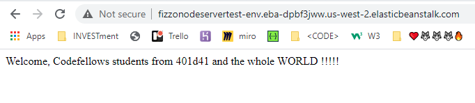
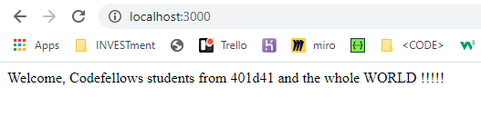

# AWS-socket-io-test-server

socket-io server for testing automatic deploy with github ACTIONS

## Author: Fizzo Pannosch

**Version**: 1.0.0

<!-- (increment the patch/fix version number if you make more commits past your first submission) -->

### 
 links and resources 

#### 
 [AWS bean stalk deployed site](http://fizzonodeservertest-env.eba-dpbf3jww.us-west-2.elasticbeanstalk.com/) 

#### 
  

#### 
  

#### 
 [github actions](https://github.com/fizzo999/cloud-server/actions/runs/829904234) 

#### 
 [merged pull request - github](https://github.com/fizzo999/cloud-server/pull/1) 

## Overview

test server deployed on AWS to show how to deploy through github actions (ci/cd)

## Setup

git clone repo from github link:
https://github.com/fizzo999/cloud-server.git

#### npm install

(to install dependencies: express)

#### Running the app

- to test this server - run the command:

- npm run start in one ubuntu window

- open a browser window on http://localhost:3000

## Architecture

- express server (index.js)

## Change Log

05-10-2021 6:45pm - Application running and manually tested in terminal.

## Credits and Collaborations

Number and name of feature: setup file structure, deploy to AWS create main.yml file for workflow w github readme - finish deploy to AWS - manual test
Estimate of time needed to complete: 2 hours
Start time: 3:00 pm
Finish time: 6:45 pm
Actual time needed to complete: 3.75 hours
